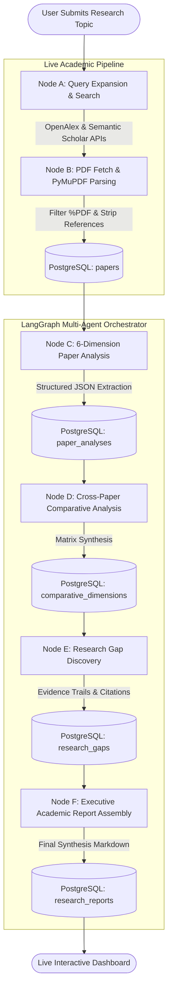

<div align="center">


### **Autonomous Agentic AI Literature Review & Gap Synthesis Platform**

[](https://fastapi.tiangolo.com)
[](https://nextjs.org)
[](https://langchain-ai.github.io/langgraph/)
[](https://ai.google.dev/)
[](https://www.postgresql.org)
[](https://www.docker.com)
[](LICENSE)

*An autonomous end-to-end multi-agent system that searches live academic repositories, downloads and analyzes full-text PDFs, extracts structured scientific dimensions, maps cross-paper comparisons, synthesizes citation-backed research gaps, and drafts publication-ready executive reports.*

---

</div>

## 📌 Executive Overview

Traditional literature reviews require researchers to manually screen hundreds of abstracts, download disparate PDFs, normalize methodologies, and deduce overlooked limitations. 

**ResearchMate** automates this entire lifecycle using a coordinated **6-Node LangGraph State Machine**. By combining live scientific APIs (**OpenAlex** and **Semantic Scholar**), high-speed PDF extraction with reference-section stripping, and **Google Gemini** reasoning, ResearchMate delivers:

1. **Deep Paper Acquisition**: Autonomous search query expansion retrieving real open-access academic literature.
2. **Reference-Stripped PDF Ingestion**: PyMuPDF extraction discarding terminal bibliographies to conserve LLM context windows.
3. **6-Dimensional Structured Analysis**: Automated extraction of Problem, Methodology, Dataset, Results, Limitations, and Future Work.
4. **Comparative Matrix Synthesis**: Cross-paper evaluation across methodologies, benchmark datasets, and empirical performance.
5. **Evidence-Backed Research Gaps**: Discovery of unexplored directions linked directly to supporting citations.
6. **Executive Synthesis Report**: Polished Markdown literature report with instant 1-click export and download.

---

## 🏛️ System Architecture

The pipeline executes as a directed acyclic LangGraph graph running asynchronously on FastAPI:



---

## ⚡ Agent Pipeline Breakdown

| Node | Role | Technology | Output Artifacts |
| :--- | :--- | :--- | :--- |
| **Node A** | **Query Expansion & Literature Search** | Gemini Flash + OpenAlex / Semantic Scholar | 3–5 expanded academic search queries; 10–20 deduplicated candidate papers with DOIs & open-access URLs |
| **Node B** | **PDF Acquisition & Text Ingestion** | `httpx` + PyMuPDF (`fitz`) | Full-text extraction with regex-based reference section stripping (saving up to 40% token overhead) |
| **Node C** | **Structured Dimension Extraction** | Google Gemini (`gemini-3.6-flash`) | Strict JSON extraction: Problem, Methodology, Dataset, Results, Limitations, Future Work |
| **Node D** | **Cross-Paper Comparative Analysis** | LangGraph State Reducer | Comparative synthesis across methodologies, datasets, and performance trade-offs |
| **Node E** | **Research Gap Discovery** | Citation Evidence Linker | Unaddressed research gaps mapped directly to paper IDs and citation titles |
| **Node F** | **Executive Report Synthesis** | Markdown Academic Formatter | Publication-grade literature review report in GitHub-flavored Markdown |

---

## 🖥️ Modern Web Interface

- **Theme Toggle (Bulb Toggle)**: Instant toggle between **Dark Mode** (Deep Obsidian OLED) and **Light Mode** (Crisp Slate Palette) with zero layout shift and local storage persistence.
- **Real-Time Agent Tracker**: Live visualizer showing step-by-step progress through Nodes A to F with active terminal logging.
- **Tabbed Results Dashboard**:
  - 📄 **Papers Explorer**: View parsed papers, abstract summaries, authors, years, and direct PDF links.
  - 📊 **Comparison Matrix**: Side-by-side comparative analysis of methodologies and benchmarks.
  - 🔍 **Research Gaps**: Unaddressed frontiers backed by verifiable paper citation trails.
  - 📝 **Executive Report**: Formatted Markdown synthesis with instant copy, print, and `.md` file download.

---

## 🚀 Quick Start Guide

### Prerequisites
- **Python 3.10+**
- **Node.js 18+** & **npm**
- **PostgreSQL 14+** (or Docker)
- **Google Gemini API Key** ([Get a key](https://aistudio.google.com/app/apikey))

---

### Option 1: Docker Compose (All-in-One)

```bash
# 1. Clone repository
git clone https://github.com/shreyans-chowdry/research_mate.git
cd research_mate

# 2. Configure environment
cp backend/.env.example backend/.env
# Add your GOOGLE_API_KEY in backend/.env

# 3. Launch PostgreSQL, Backend, and Frontend containers
docker compose up --build
```
The application will be accessible at:
- Frontend: `http://localhost:3000`
- Backend API Docs: `http://localhost:8000/docs`

---

### Option 2: Local Development Setup

#### 1. Backend Setup
```bash
# Navigate to workspace
cd ResearchMate

# Create and activate virtual environment
python3 -m venv venv
source venv/bin/activate

# Install backend dependencies
pip install -r backend/requirements.txt

# Configure environment
cp backend/.env.example backend/.env
# Set DATABASE_URL and GOOGLE_API_KEY in backend/.env

# Initialize database schema & run verification
python3 backend/db/test_db.py

# Start FastAPI development server
uvicorn backend.api.main:app --reload --port 8000
```

#### 2. Frontend Setup
```bash
# In a new terminal
cd ResearchMate/frontend

# Install dependencies
npm install

# Start Next.js development server
npm run dev
```
Open [http://localhost:3000](http://localhost:3000) in your browser.

---

## 📡 REST API Reference

All backend endpoints follow a clean RESTful specification:

| Method | Endpoint | Description |
| :--- | :--- | :--- |
| `POST` | `/api/research` | Initialize a new research project and dispatch autonomous pipeline |
| `GET` | `/api/research/{id}/status` | Poll project execution status, completed steps, and paper counts |
| `GET` | `/api/research/{id}/papers` | Retrieve all acquired papers and their 6-dimension analyses |
| `GET` | `/api/research/{id}/comparisons` | Fetch cross-paper comparative dimensions |
| `GET` | `/api/research/{id}/gaps` | Fetch synthesized research gaps with supporting evidence trails |
| `GET` | `/api/research/{id}/report` | Fetch final Markdown executive synthesis report |
| `GET` | `/health` | Health check endpoint |

---

## 🧪 Testing & Verification

Run automated test suites to verify end-to-end functionality:

```bash
# Test 1: Database Connection & DDL Schema
python3 backend/db/test_db.py

# Test 2: Academic Search & PDF Processing Pipeline
python3 backend/pipeline/test_pipeline.py

# Test 3: LangGraph Multi-Agent Orchestrator
python3 backend/api/agents/test_agents.py

# Test 4: FastAPI REST Endpoints
python3 backend/api/test_api.py

# Test 5: Full End-to-End Autonomous Pipeline
python3 backend/test_run.py

# Test 6: Frontend Production Build
npm --prefix frontend run build
```

---

## 📄 License

Distributed under the MIT License. See [LICENSE](LICENSE) for more details.
